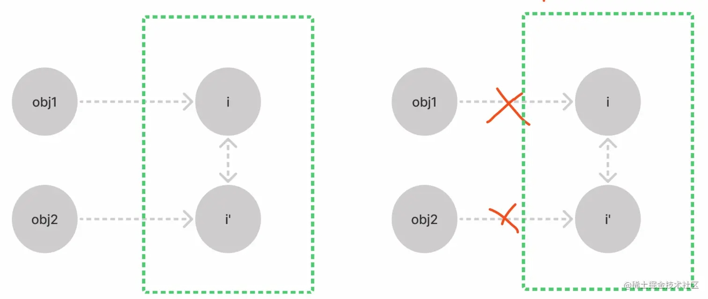
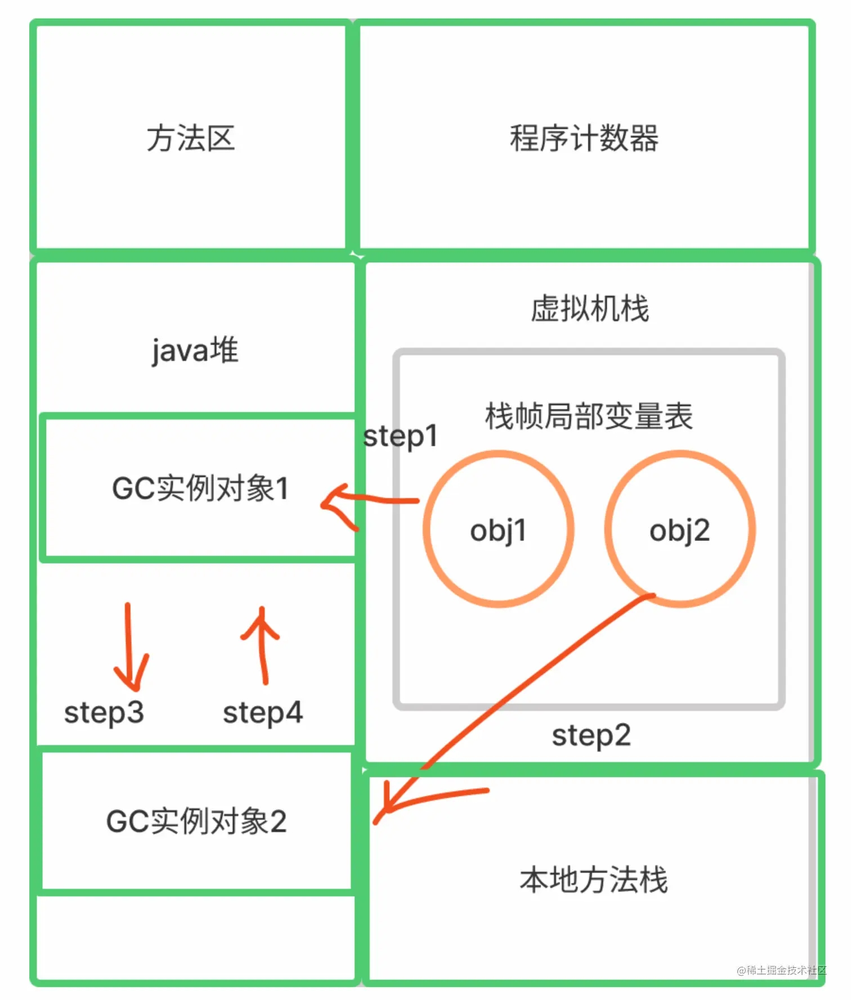
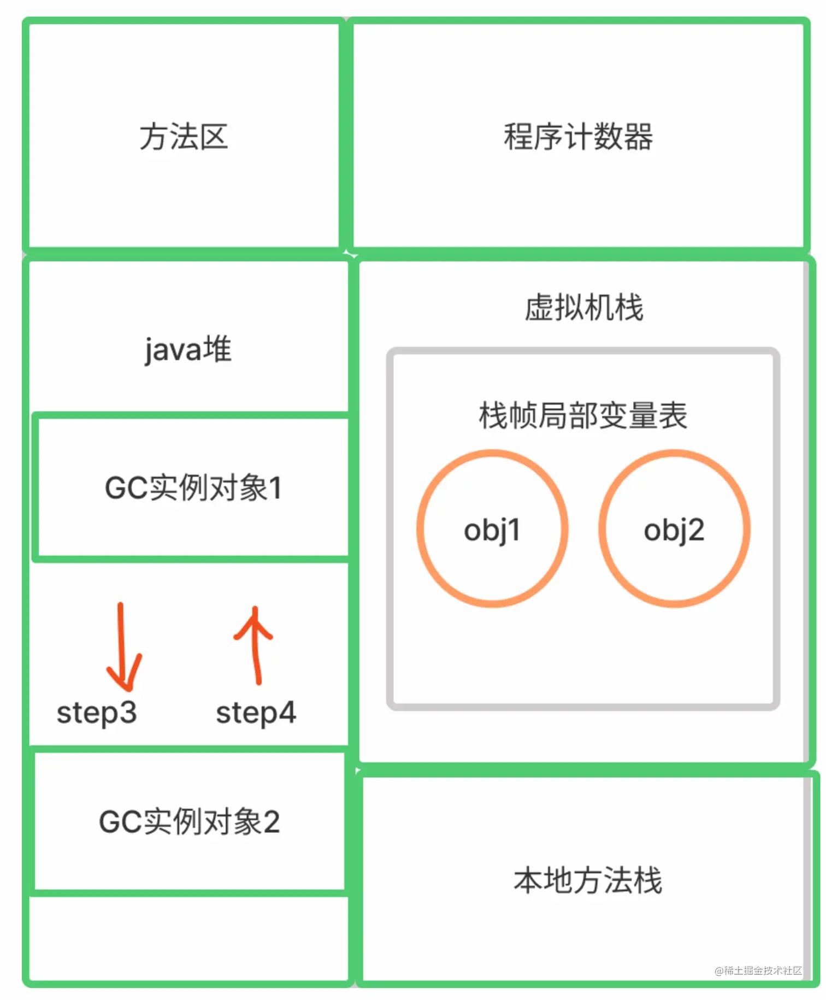
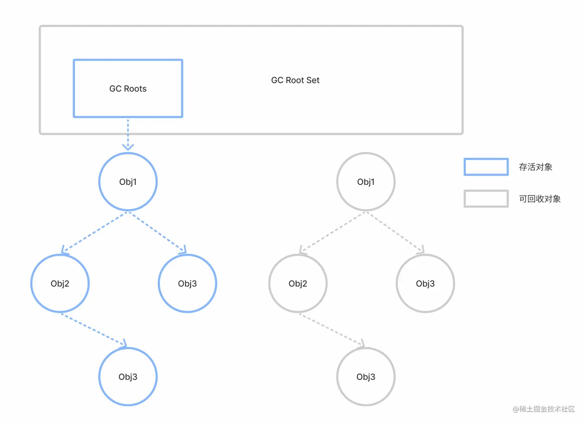
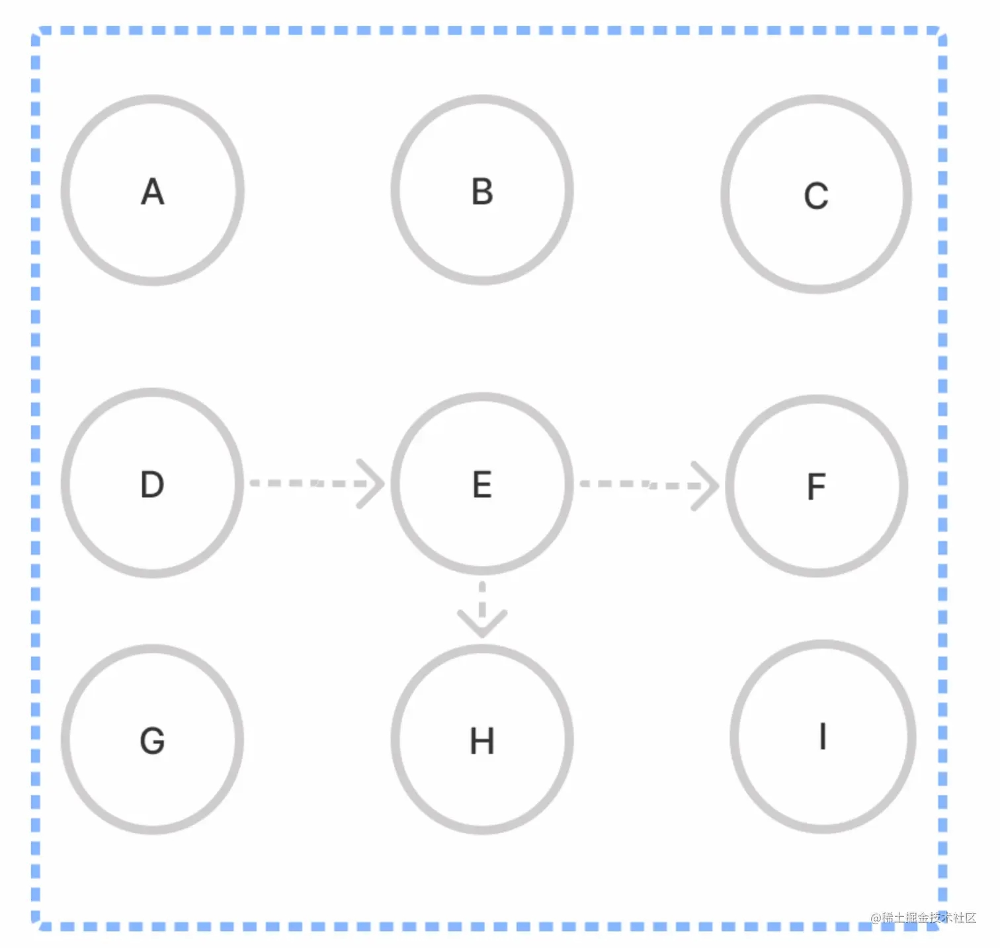
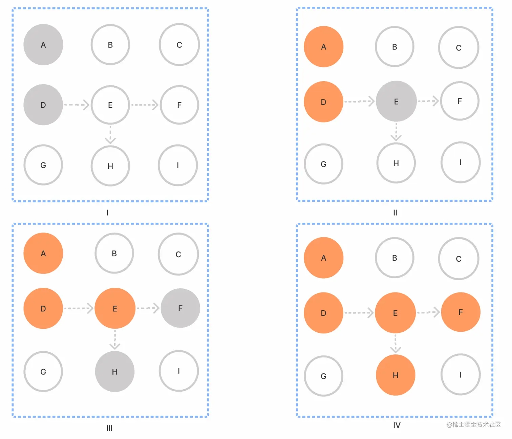
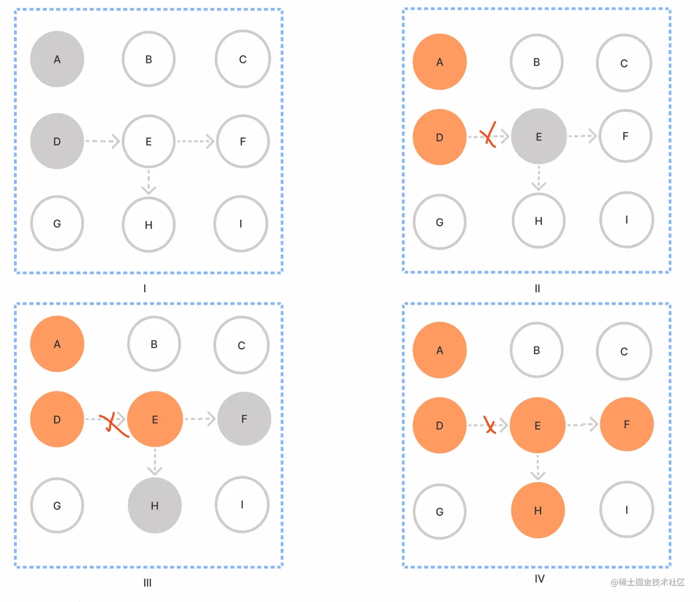
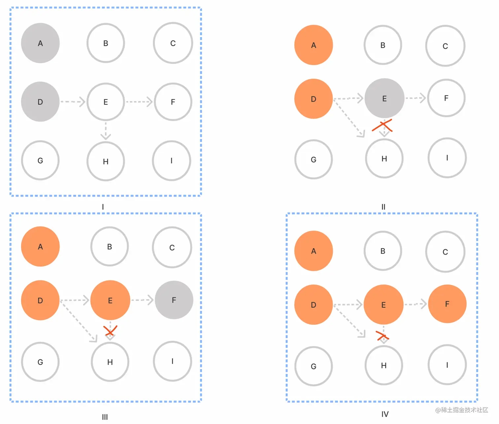
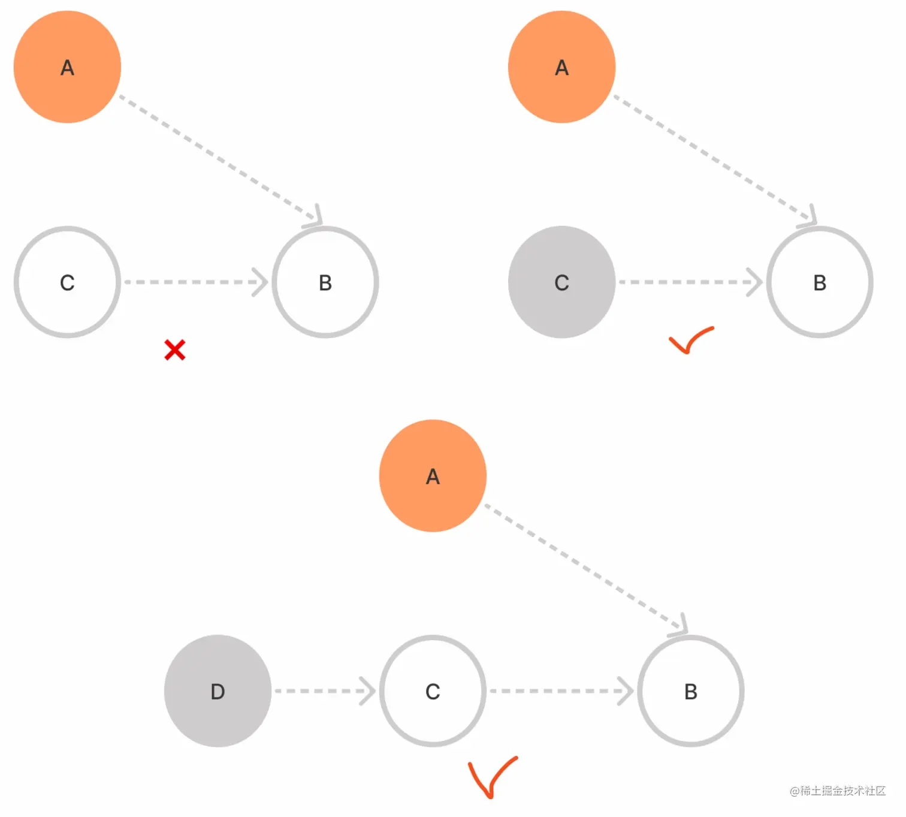

> 本文已参与「新人创作礼」活动，一起开启掘金创作之路。

## 前言

众所周知，一门优秀的语言总会需要考虑很多点，比如说性能、内存、并发处理等，把其语言开发到一个高度。这一期我们学习的内容是内存方面的，并且结合 Java 和 Go 语言去阐述经典的内存垃圾对象回收算法。

## 什么是垃圾回收

在计算机科学中，**垃圾回收**（英语：Garbage Collection，缩写为 GC）是指一种自动的存储器管理机制。当某个程序占用的一部分内存空间不再被这个程序访问时，这个程序会借助垃圾回收算法向操作系统归还这部分内存空间。

通常占用程序空间都是一些运行对象，对象可包含的数据在一定限度是非常占用内存空间的，在某一时刻，就会达到操作系统规划的内存空间，若数量多起来了，就会超过该空间导致机器卡顿或者宕机情况发生。

我们思考的方向便是既要最大化的利用计算机性能，又要保护计算机正常稳定的运转下去，就如同大自然一样，循环利用资源，这样才有可能实现持久化程序生态。

现在业界垃圾回收器可以总结为两种收集器：

**引用计数收集器** - 最早的也是最简单的垃圾回收实现方法，这种方法为占用物理空间的对象附加一个*计数器*，当有*其他对象引用这个对象时计数器加一，反之引用解除时减一*。这种算法会定期检查尚未被回收的对象的计数器，为零的话则回收其所占物理空间，因为此时的对象已经无法访问。这种方法无法回收循环引用的存储对象。

**跟踪收集器** - 近现代的垃圾回收实现方法，这种算法会定期遍历它管理的内存空间，从*若干根储存对象开始查找与之相关的存储对象*，然后标记其余的没有关联的存储对象，最后回收这些没有关联的存储对象占用的内存空间。

这两个收集器的思想也会在 Java 和 Go 的垃圾回收器中有所体现，下面开始介绍。

## Java 的垃圾回收回顾

### 引用计数法

将资源（可以是对象、内存或磁盘空间等等）的被引用次数保存起来，当被引用次数变为零时就将其释放的过程。使用引用计数技术可以实现自动资源管理的目的。同时引用计数还可以指使用引用计数技术回收未使用资源的垃圾回收算法。

**优点**：实现简单，垃圾对象便于辨识；判定效率高，回收没有延迟性。

**缺点**：循环引用会造成垃圾对象无法回收。

**例子**：

```java
public class GcDemo {
    public void demo {
        // 分为 6 个步骤
        GcObject obj1 = new GcObject(); // Step 1
        GcObject obj2 = new GcObject(); // Step 2

        obj1.instance = obj2; // Step 3
        obj2.instance = obj1; // Step 4

        obj1 = null; // Step 5
        obj2 = null; // Step 6
    }
}

class GcObject{
    public Object instance = null;
}
```

**实现图如下所示**：



可以看出即便 obj1 和 obj2 断开了引用链的链接但依然存在内部引用关系链，这样如果大家看到这里还是很可能不明不白的，比如说为啥计数器是 2 而不是 1 这样。我们得从底层出发，这里简单的介绍下关于 Java 的内存模型，结合内存模型来说下。



- Step1：GcObject 实例 1 的引用计数加 1，实例 1 的引用计数=1
- Step2：GcObject 实例 2 的引用计数加 1，实例 2 的引用计数=1
- Step3：GcObject 实例 2 的引用计数再加 1，实例 2 的引用计数=2
- Step4：GcObject 实例 1 的引用计数再加 1，实例 1 的引用计数=2

执行到 Step 4，则 GcObject 实例 1 和实例 2 的引用计数都等于 2。

**断开引用后**：



会发现实际上 obj1 和 obj2 均不指向 Java 的堆，但是在堆内实例对象还会相互引用，计数器还是没有为零，这导致实际上应该回收 obj1 和 obj2 的没有回收，导致内存泄露。

### 可达性分析法

可达性分析算法，又叫根搜索算法或者追踪性垃圾收集。

可达性分析算法是以根对象集合（GC Roots）为起始点，按照从上至下的方式搜索被根对象集合所连接的目标对象是否可达。使用可达性分析算法后，内存中的存活对象都会被根对象集合直接或间接连接着，搜索所走过的路径称为**引用链**（Reference Chain）。如果目标对象没有任何引用链相连，则是不可达的，就意味着该对象已经死亡，可以标记为垃圾对象。在可达性分析算法中，**只有能够被根对象集合直接或者间接连接的对象才是存活对象**。



**优点**：解决引用计数器所不能解决的循环引用问题。即便对象 a 和 b 相互引用，只要从 GC Roots 出发无法到达 a 或者 b，那么可达性分析便不会将它们加入存活对象合集之中。

**缺点**：由于需要从 GC Roots 开始逐个检查引用，所以**耗时**是缺点之一，而且在此期间，需要保证整个执行系统的一致性，对象的引用关系不能发生变化，所以会导致 GC 进行时必须停顿所有 Java 执行线程（**STW**）。(遍历耗时长)

## Go 的垃圾回收学习

### 三色标记法 (tricolor mark-and-sweep algorithm)

首先将对象用三种颜色表示，分别是黑色、灰色和白色。最开始所有对象都是白色的，然后把其中全局变量和函数栈里的对象置为灰色。第二步把灰色的对象全部置为黑色，然后把原先灰色对象指向的变量都置为灰色，以此类推。等发现没有对象可以被置为灰色时，所有的白色变量就一定是需要被清理的垃圾了。

**遍历集合，判断垃圾对象回收步骤**：

- Step 1: 创建黑、灰、白三个集合
- Step 2: 将所有对象放入白色集合中
- Step 3: 从根节点开始遍历所有对象，把遍历到的对象从白色集合放入灰色集合（备注：这里放入灰色集合的都是根节点的对象）
- Step 4: 遍历灰色集合，将灰色对象引用的对象从白色集合放入灰色集合，然后将分析过的灰色对象放入黑色集合
- Step 5: 重复以上的步骤直到对象遍历结束





虽然这样很容易理解，但是也是理想情况回收，真正在我们的程序运行中会有很多情况发生。这些情况就会造成该对象应该不被回收但是被错误回收，应该被回收的没有被回收。可以总结以下两种问题：**多标 - 浮动垃圾**和**漏标 - 悬挂指针问题**。

### 多标 - 浮动垃圾

**对象之间的引用链断开却没有把其变为可回收对象，反倒作为灰色对象继续存活下去。这部分垃圾对象没有被正确的回收成为"浮动垃圾"**。



### 漏标 - 悬挂指针问题

指中间对象之间断开引用链后，指向在引用的对象断开的引用对象并没有在做遍历处理，导致对象没有遵循三色原则作为垃圾对象被回收。



- Step1: 正常遍历，E 断开 H 的引用，但是此时没有将 H 放入灰色集合，D 直接引用 H
- Step2: 继续正常遍历，E 变成黑色，F 变成灰色，但是由于 E 断开了 H 的引用而 D 是黑色不会再次遍历对 H 的引用
- Step3: H 作为白色对象被回收

Ps：所以本想用 H 的，你给我回收了？😠

这就是设计最不可被接受的一点。

### 内存屏障原理

于是后续有大神提出了**内存屏障**原理。

> A **memory barrier**, is a type of barrier instruction that causes a central processing unit (CPU) or compiler to enforce an ordering constraint on memory operations issued before and after the barrier instruction. This typically means that operations issued prior to the barrier are guaranteed to be performed before operations issued after the barrier.

翻译过来就是：

**内存屏障是一种屏障指令，它使中央处理器（CPU）或编译器对屏障指令前后发出的内存操作强制执行排序约束，在屏障之前发布的操作一定优先于屏障之后发布的操作。**

什么意思呢？

提取几个关键词：**CPU/编译器**、**强制执行**、**排序约束**、**屏障操作**

用我自己的一句话来说就是——**硬核排序**。

排序的强制约束会让程序执行的过程中不会导致指令乱序，操作之前的指令还是操作之前的指令，不会因为程序的 xx 原因导致的指令乱序，而影响程序正常的表达。

比如在三色中，程序在遍历所有的集合去染色，在某个操作前的染色还未执行完，难道操作后的染色比操作前的染色执行的更早吗？那肯定不行的。

所以就有了以下两种三色定性要求：

- **强三色不变性（strong tri-color invariant）**：黑色不会到白色，只有黑和灰
- **弱三色不变性（weak tri-color invariant）**：黑色对象可以到白色对象，该白色对象上游一定存在一个灰色对象引用，并且所有被黑色对象引用的白色对象都处于灰色保护状态



#### Dijkstra 方法（插入屏障，强三色，Go1.7 之前）

```go
// 伪代码 Dijkstra
DijkstraWritePointer(slot, ptr)
  // 如果对象不是灰色对象，先置灰
  shade(slot)
  // 赋值
  *slot = ptr
```

Dijkstra 方法是标准的强三色处理方式，但是这样就需要在 STW 期间必须重新扫描许多堆栈，重新扫描就意味着额外的性能开销，这个对于优良程序设计是不太友好的。

看看在《Proposal: Eliminate STW stack re-scanning》一文中提到：

> writes to pointers on the stack must have write barriers, which is prohibitively expensive, or stacks must be *permagrey*. Go chooses the later, which means that many stacks must be re-scanned during STW. The garbage collector first scans all stacks at the beginning of the GC cycle to collect roots. However, without stack write barriers, we can't ensure that the stack won't later contain a reference to a white object, so a scanned stack is only black until its goroutine executes again, at which point it conservatively reverts to grey.

翻译过来就是：

> 写入堆栈上的指针必须要有写屏障，但是这意味着代价相当的高，且堆栈必须是恒灰。**Go 选择在 STW 期间必须重新扫描大量的栈**。垃圾收集器首先在 GC 周期开始时扫描所有堆栈以收集根对象。然而如果没有栈写屏障操作，我们无法确保栈后面是否不会包含对白色对象的引用，因此直到它的 goroutine 再次执行之前扫描的栈只有黑色的，此时它会恢复为灰色。

用一句话来解释就是：

这个方法得先标记对象为灰色后重新扫描这些栈而导致的大量的性能开销，且栈必须要有写屏障，这个如果没有，那么在栈上的对象在断开再次引用其他对象的时候很有可能下一个被引用的对象因为没被写屏障置灰会被回收。

这个方法有篇文章介绍的很好：[GC 时写屏障与栈的引用变化](https://cloud.tencent.com/developer/article/1769823)

#### Yuasa 方法（删除屏障，弱三色，Go1.8）

这个是 Yuasa 提出的删除屏障概念，满足弱三色的处理方式，其思想是**集合中取出灰对象或白色对象删除白色指针时，通过写屏障这个操作通知给并发回收器**。

在 GC 开始时 STW 扫描堆栈来记录初始快照，这个过程会记录开始时刻的所有存活对象，但结束时无需 STW。

```go
// 伪代码 Yuasa
YuasaWritePointer(slot, ptr)
  // 假设对象为黑色，确保在 ptr 赋值前不是白色，先置灰
  // 这样总能从下往上找到找到一条到达灰色对象的路径，保证弱三色原理
  // 删除屏障
  shade(*slot)
  if current stack is grey: // 这行可以忽略
    // 插入屏障
    shade(ptr)
  // 赋值
  *slot = ptr
```

#### Hybrid 方法（混合写屏障）

它的原理很简单，对正在覆盖的对象置灰，如果扫描未完成，指针也置灰。

这是吸收了 Yuasa 和 Dijkstra 方法，这样做不仅简化 GC 的流程，也减少标记终止阶段的重扫成本。

```go
// 伪代码 Hybrid
HybridWritePointer(slot, ptr):
  // 对象先置灰
  shade(*slot)
  // 如果栈是灰色的
  if current stack is grey:
    // ptr 置为灰色
    shade(ptr)
  // slot 指针置灰
  *slot = ptr
```

同时 GC 阶段也有个强制点，新建对象全部置黑色，防止被回收器错误回收。

## 总结

学习了这三种的收集器不禁感叹其实很多语言设计者在这一块可谓绞尽脑汁去思考，因为对于一门优秀的语言来说如何去更好的让它实现持久化、智能自动化处理的程序运行下去，既需要技术也是需要时间沉淀的。我在想 Go 能不能直接抄了 Java 的这个回收器得了，虽然因为 Go 语言和 Java 在很多方面还是有所区别，所以不能是统一个回收机制。

ps：你怎么知道人家没想过抄呢？😄

## 文章致谢

- 《可达性算法笔记》
- 《两万字长文带你深入 Go 语言 GC 源码》- 三色回收
- 《维基百科 - 垃圾回收（计算机科学）一章》
- Proposal: Eliminate STW stack re-scanning: https://go.googlesource.com/proposal/+/master/design/17503-eliminate-rescan.md
- GC 时写屏障与栈的引用变化：https://cloud.tencent.com/developer/article/1769823
