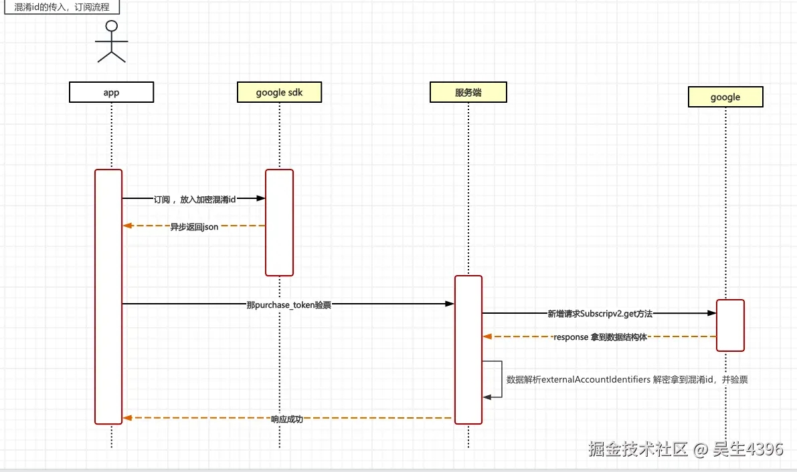

> Hello 大家好，我是发帖狂魔小吴，今天带来一个 Google Play 支付流程的研究。

## 背景

我们都知道，Google Play 也好，iOS 也好都会存在丢单的情况。丢单的场景无非就是：

- 网络异常
- 用户登录账号切换
- 其他原因导致无法将购买的账单给到正确的账号发放等价值的虚拟东西

解决此类问题的方法就是通过账单对应的方式，通过我们自身的业务账单号与谷歌这边的账单号形成对应的映射关系，校验购买状态一致后才去发放才是正确的逻辑。

但是众所周知 Google 的支付相关和我们的支付宝或者微信并非相同。在之前团队内部的认知中是**不支持自定义透传字段的**，源于客户端谷歌这边并没有其他原生的方法去接收相关的参数，所以没办法推进。

然而最近在做 Google Play 支付和订阅的调研，偶然发现**原来谷歌支持业务的自定义数据透传**！这个发现让我很惊喜，待我下文慢慢分析。

## 研究过程

Google Play 的文档：[安卓发起构建支付参数](https://developer.android.com/reference/com/android/billingclient/api/BillingFlowParams.Builder)

经过调研 Google Pay 的安卓相关的 API 文档，我们发现 GP 有提供关于混淆透传 ID 的方法：

> Specifies an optional obfuscated string that is uniquely associated with the purchaser's user account in your app.
>
> If you pass this value, Google Play can use it to detect irregular activity, such as many devices making purchases on the same account in a short period of time. Do not use this field to store any Personally Identifiable Information (PII) such as emails in cleartext. Attempting to store PII in this field will result in purchases being blocked. Google Play recommends that you use either encryption or a one-way hash to generate an obfuscated identifier to send to Google Play. You can also retrieve this identifier via the Purchase object.
>
> This identifier is limited to 64 characters.

上述翻译过来：

> 指定一个可选的模糊字符串，该字符串与应用程序中购买者的用户帐户唯一关联。
>
> 如果您传递此值，Google Play 可以使用它来检测不规则活动，例如在短时间内许多设备在同一帐户上进行购买。**请勿使用此字段以明文形式存储任何个人身份信息（PII），如电子邮件**。尝试在此字段存储 PII 将导致购买被阻止。Google Play 建议您使用加密或单向哈希来生成混淆的标识符，以发送到 Google Play。您还可以通过 Purchase 对象检索此标识符。
>
> 此标识符限制为 64 个字符。

这个描述无疑在宣布谷歌支持 **[setObfuscatedAccountId](https://developer.android.com/reference/com/android/billingclient/api/BillingFlowParams.Builder#setObfuscatedAccountId(java.lang.String)) 混淆字段**的使用。

那么我们的数据中如果传入类似的【账单 ID】【用户特殊信息】这些业务信息，透传给到谷歌后就可以完美的通过谷歌 GET 接口拿到对应透传的业务数据。这样既保证账单数据在某种程度上的一致性，又能让我们做一些其他异常处理。

> PS：这不才是正常的操作？我只想把我们的数据传给你们，兜兜转转一圈我希望你们能还给我，让我确认一致性，我有错吗？？（iOS：你有错！）

## 订阅场景

APP 中进行的订阅场景，我们可以看下述时序图的设计：

### 流程说明

1. **App 端发起订阅流程**，加密传入混淆 ID，通过 SDK 传入谷歌服务器
2. **谷歌服务器异步回调**到 app 中，拿到对应的购买的票据 `purchase_token`
3. 通过 `purchase_token` 请求 **[获取订阅用户数据](https://developers.google.com/android-publisher/api-ref/rest/v3/purchases.subscriptionsv2/get?hl=zh-cn)** 接口，返回对应的 Resp 结构体
4. 其中 **[SubscriptionPurchaseV2](https://developers.google.com/android-publisher/api-ref/rest/v3/purchases.subscriptionsv2?hl=zh-cn#SubscriptionPurchaseV2)** 方法对应的结构中存在 **[ExternalAccountIdentifiers](https://developers.google.com/android-publisher/api-ref/rest/v3/purchases.subscriptionsv2?hl=zh-cn#ExternalAccountIdentifiers)** 结构体，对应存在一个字段 `obfuscatedExternalAccountId`
5. **服务端解析** `obfuscatedExternalAccountId` 字段即可绑定谷歌账单

这样看上去，我们的业务购买账单时非常清晰，下面的充值流程同理。

## 支付场景

商品购买的支付场景，一般我们会对接 Google Play 的充值相关的接口。同上述的图设计，客户端在支付流程中通过 SDK 先进行数据的透传后，我们可以通过：

谷歌的方法 **[获取用户的票据信息](https://developers.google.com/android-publisher/api-ref/rest/v3/purchases.products/get?hl=zh-cn)** 接口去获取到对应的购买数据，同时获取到结构体 **[ProductPurchase](https://developers.google.com/android-publisher/api-ref/rest/v3/purchases.products?hl=zh-cn#ProductPurchase)**

通过解析也可以获取到 `obfuscatedExternalAccountId` 对应的数据。

## 总结 & 思考

通过上述的混淆方式，我们就可以从业务出发，从头到尾获取得到我们自定义的业务 ID。这样在关联数据的时候，即可从我们的账单 ID 关联到谷歌这边的账单 ID，无需关注回调的情况，也不用关心回调是否作用于同一个账号。

从而不会出现在 **【同设备同账号的情况下，非购买方的 app 账号接收到了回调的错误处理方式】** 即可得到解决。

当然这样也仅仅是作用于 **【同设备但是不同 app 账号，在接收同一个回调的时候】** 的表现。我们强制绑定了谷歌的账单 ID 后，账号的购买后的账单也就有了第三方的根据，即可对应的发放虚拟产品或者奖励。

对于 Google Play 回调如果出现了网络异常，就是根本就没有办法挽救，只能服务器再次接入谷歌的支付回调体系，然后通过体系再整合混淆 ID、绑定关系，这样的流程也无可厚非。

通过自身的产品的流量情况，在评估具体的工作内容，否则做了成效不大，是否有一定的价值呢？

---

欢迎来评论，打扰您的闲暇时间，高抬贵手求点赞 ~(\^_\-)
